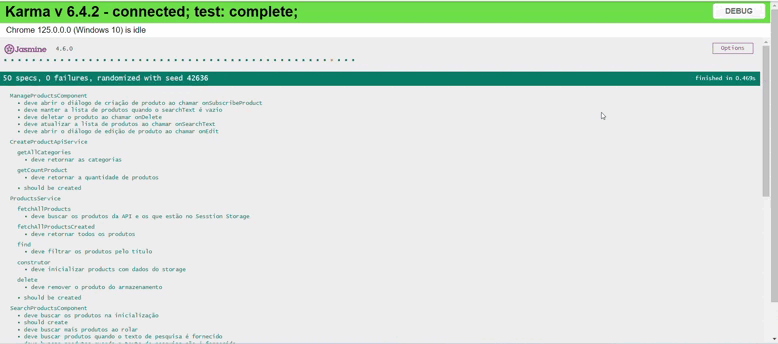
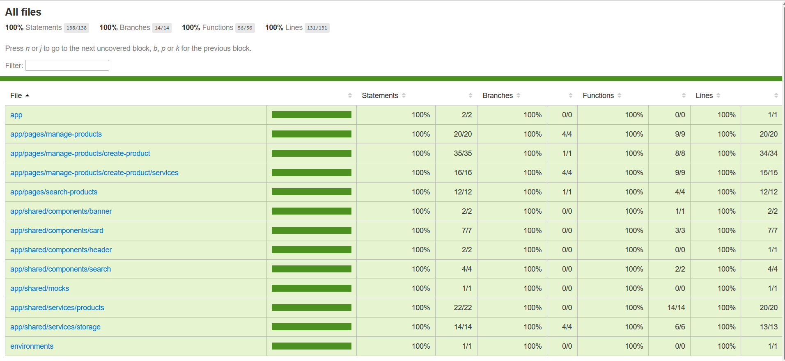

<p align="center">
  <a href="#about">Sobre</a>&nbsp;&nbsp;&nbsp;|&nbsp;&nbsp;&nbsp;  
  <a href="#technologies">Tecnologias usadas</a>&nbsp;&nbsp;&nbsp;|&nbsp;
  <a href="#preview">Prévia</a>&nbsp;&nbsp;&nbsp;|&nbsp;&nbsp;&nbsp;
  <a href="#rodar">Como rodar os testes</a>&nbsp;&nbsp;&nbsp;|&nbsp;&nbsp;&nbsp;
  <a href="#license">Licença</a>
</p>

<p align="center">
  

  

  
</p>

<a id="about"></a>

## :books: Sobre

Zoop Store é um e-commerce recheado de produtos de diversas verdentes.

O App oferece uma prática lista de produtos, apresentando detalhes como título, valor, descrição e imagem para uma visualização completa. Além disso, proporciona a conveniência de gerenciar esses produtos, permitindo operações como cadastro, remoção e atualização. Vale ressaltar que as informações do aplicativo são armazenadas localmente no navegador, o que significa que serão perdidas ao fechar o aplicativo.

A Zoop Store é um e-commerce fictícia utilizada no curso de testes da Alura.
A ideia principal do curso é apresentar os principais conceitos de testes no ecossistema do Angular.

<a id="technologies"></a><br>

## ⚒️ Tecnologias usadas

- HTML
- CSS
- Uuid
- Karma
- Jasmine
- Angular
- Typescript
- Angular Material

<a id="preview"></a><br>

## :tv: Prévia

- Projeto
  

- Testes
  

- Cobertura no coverage
  

<a id="rodar"></a><br>

## 🚀 Como rodar os testes

- Clone este repositório

```
git clone https://github.com/RuthMaria/3664-zoop-store.git
```

- Instalar as dependêncies

```
npm install
```

- Rodar o projeto

```
npm run start
```

- Rodar os testes

```
npm run test
```

- Rodar a cobertura do coverage; em seguida abrir o arquivo index.html da pasta coverage

```
npm run coverage
```

<a id="license"></a><br>

## :memo: Licença

Este projeto está sob licença do MIT. Consulte o arquivo [LICENSE](LICENSE.md) para obter mais detalhes.

---

<h4 align="center">
    Desenvolvido com ❤️ por <a href="https://www.linkedin.com/in/ruth-maria-9b256071/" target="_blank">Ruth Maria</a>
</h4>
